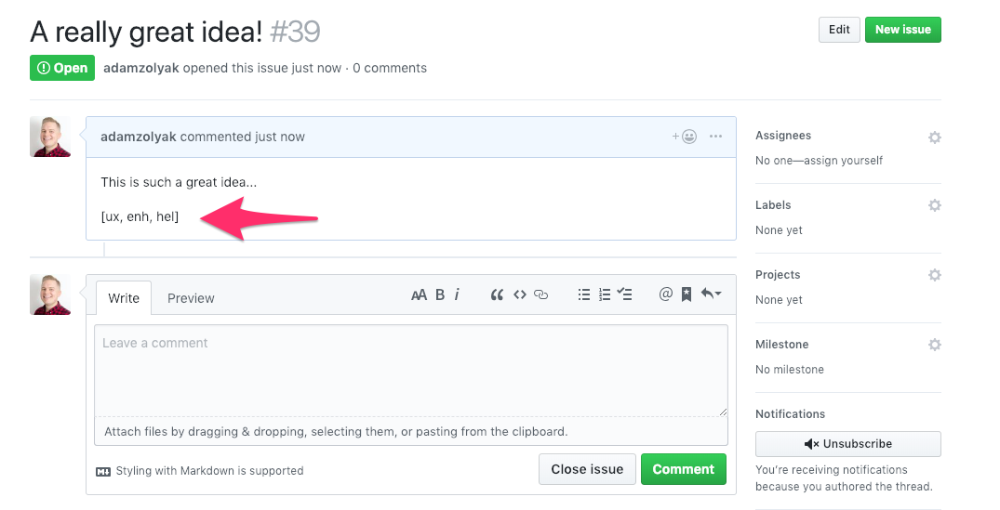
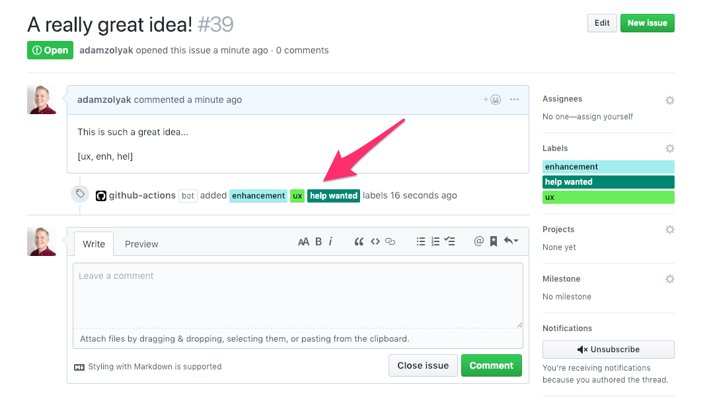

# 🏷 🏷 🏷 Issue Bulk Labeler - GitHub Action

A [GitHub Action](https://github.com/features/actions) to add bulk labels when creating a new issue.

## How It Works

This GitHub Action runs when an [`issues` event webhook](https://developer.github.com/v3/activity/events/types/#issuesevent) is fired in your GitHub repo. The action checks if there is an array of bulk labels to add `[aaa, bbb, ccc]` in markdown in the issue's description. The action works with existing labels defined in your GitHub repo; the labeler expects the first 3 characters of the label name (ex. `hel` for a "help wanted" label). If there is 1 or > bulk labels, the action labels the issue with the specified label(s).

## Examples

Example of a new issue with an array of bulk labels in the issue's description:


Example of the issue after the bulk labels are added to the issue:


## Installation

To use this GitHub Action, you must have access to [GitHub Actions](https://github.com/features/actions). GitHub Actions are currently only available in private beta (you must [apply for access](https://github.com/features/actions)) and only work in private repos.

To setup this action:

1. Create a `.github/worksflows/main.yml` in your GitHub repo ([more info](https://help.github.com/en/articles/configuring-a-workflow)).
2. Add the following code to the `main.yml` file and commit it to the repo's `master` branch.

```yaml
name: Bulk Issue Labeler

on: issues

jobs:
  labelIssue:
    name: Bulk Issue Labeler
    runs-on: ubuntu-latest
    steps:
      - uses: adamzolyak/issue-labeler-action@master
        env:
          GITHUB_TOKEN: ${{ secrets.GITHUB_TOKEN }}
```

3. Whenever you create an issue, the action will run!

## Contributing

If you have suggestions for how this GitHub Action could be improved, or want to report a bug, open an issue! Or pull request! We'd love all and any contributions. For more, check out the [Contributing Guide](CONTRIBUTING.md).

## License

[ISC](LICENSE) © 2019 Adam Zolyak <adam@tinkurlab.com> (www.tinkurlab.com)
